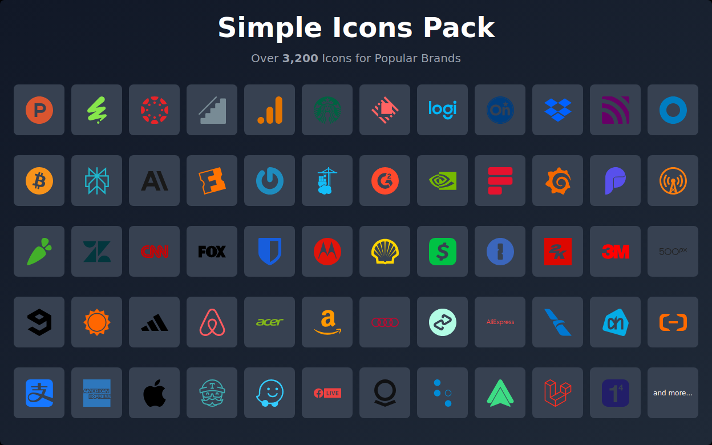
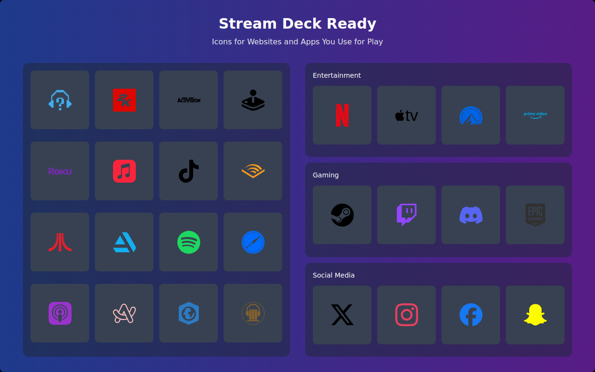
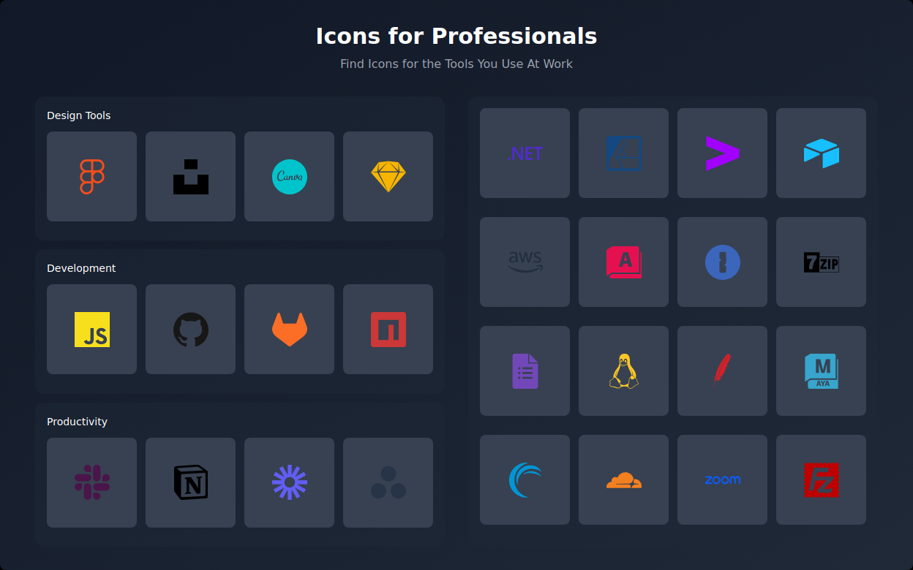

# Simple Icons Stream Deck
 Elgato Stream Deck icons pack containing 3200+ Logos for common brands and tools. Based on [Simple Icons](https://simpleicons.org/). Used by over 41,000 people.

 Updated to Simple Icons Version: 15.2.0

 Samples:

 
 

 ## Installation
 **Icon Store:**  
Install from the Stream Deck store either on [the web here](https://marketplace.elgato.com/product/simple-edbee553-243d-44d8-96bf-7d73690f3ed1) or by searching for "Simple Icons" in the Stream Deck store.
  
 **Manual:**
1. Download the latest streamDeckIconPack file from [releases](https://github.com/mackenly/simple-icons-stream-deck/releases).
2. Run the file from your downloads folder.
3. Open the Stream Deck app, and your icons should appear in the icon selector.

## Contributing and Copyright
The icons in this icon pack are based on the [simple-icons/simple-icons](https://github.com/simple-icons/simple-icons) icons. To request a new icon, please open an issue on [here](https://github.com/simple-icons/simple-icons/issues) or to request the removal of your intellectual property please open an issue both in the [parent repository](https://github.com/simple-icons/simple-icons/issues) and in [this repository](https://github.com/mackenly/simple-icons-stream-deck/issues). Before using or downloading this icon pack, please read the [simple-icons/simple-icons disclaimer](https://github.com/simple-icons/simple-icons/blob/develop/DISCLAIMER.md).

If you would like to propose an improvement to the generation script, please create an [issue here](https://github.com/mackenly/simple-icons-stream-deck/issues) first to discuss the changes. Docs for creating icon packs can be found [here](https://docs.elgato.com/makers/stream-deck/icon-packs/overview).

This project is licensed under the [CC0 1.0 Universal (CC0 1.0) Public Domain Dedication](https://creativecommons.org/publicdomain/zero/1.0/). However, that doesn't mean that the icons are licensed the same or that they can be used without restrictions.
